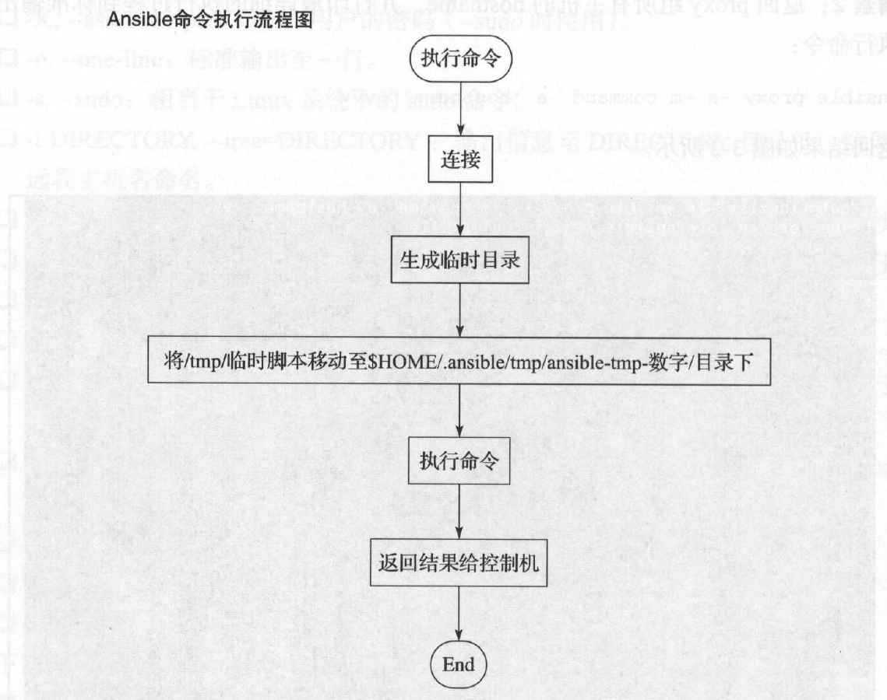

## Ad-Hoc命令用法简介

命令用法如下：
```bash
ansible <host-pattern> [options]

可用options有
-v,--verbose:输出更详细的执行过程信息，-vvv可得到执行过程所有的信息。
-i PATH,--inventory=PATH:指定inventory信息，默认/etc/ansible/hosts。
-f NUM,--forks=NUM:并发线程数，默认5个线程。
--private-key=PRIVATE_KEY_FILE：指它密钥文件。
-m NAME,--module-name=NAME:指定执行使用的模块。
-M DICECTORY，--module-path=DIRECTORY:指定模块存放路径，默认/usr/share/ansible，也可以通过ANSIBLE_LIBRARY设定默认路径。
-a 'ARGUMENTS'，--args='ARGUMENTS':模块参数。
-k,--ask-pass SSH: 认证密码。
-K,--ask-sodu-pass sudo:用户的密码（--sudo时使用）
-o,--one-line:标准输出 至一行。
-s,--sudo:相当于Linux系统下的sodu命令。
-t DIRECTORY,--tree=DIRECTORY:输出信息到DIRECTORY目录下，结果文件以远程主机名命名。
-T SECONDS,--timeout=SECONDS:指定连接远程主机的最大超时，单位是秒。
-B NUM,--background=NUM:后台执行命令，超NUM秒后中止正在执行的任务。
-P NUM,--poll=NUM:定期返回后台任务进度。
-u USERNAME,--user=USERNAME:指定远程主机以USERNAME运行命令。
-U SUDO_USERNAME,--sudo-user=SUDO_USERNAME:使用sudo,相当于Linux的sudo命令。
-c CONNECTION,--connection=CONNECTION:指定连接方式，可用选项paramiko(SSH)、ssh、local,local方式常用于crontab和kickstarts。
-l SUBSET,--limit=SUBSET:指定主机运行。
-l ~REGEX,--limit=~REGEX:指定运行主机（正则）。
--list-hosts:列出符合条件的主机列表，不执行任何命令。
```

Ansible命令执行流程图如下：
